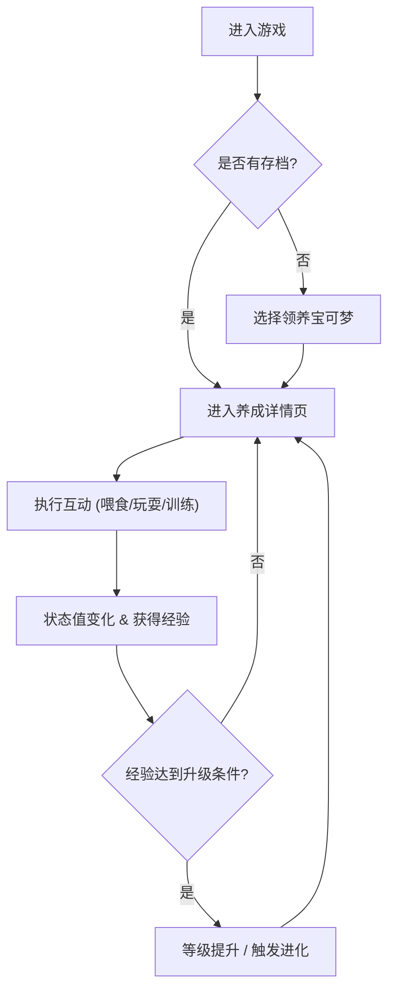

## 1. 产品概述
这是一款以“宝可梦”为主题的休闲养成Web游戏。用户可以领养初始宝可梦，通过喂食、清洁、玩耍、训练等互动行为提升其属性和经验值，最终达成进化。游戏主要面向宝可梦爱好者，提供轻松治愈的电子宠物体验。

## 2. 核心功能

### 2.1 用户角色
| 角色 | 注册方式 | 核心权限 |
|------|---------------------|------------------|
| 玩家 | 自动分配 (LocalStorage缓存) | 领养、互动、保存游戏进度 |

### 2.2 功能模块
1. **主页 (领养中心)**: 游戏开始页面，展示可领养的初始御三家宝可梦（如小火龙、妙蛙种子、杰尼龟）。
2. **养成详情页**: 游戏核心界面，包含宝可梦动态形象、状态栏（饱食度、心情、等级、经验值），以及互动操作面板。

### 2.3 页面详情
| 页面名称 | 模块名称 | 功能描述 |
|-----------|-------------|---------------------|
| 主页 | 领养模块 | 选择并领养一只初始宝可梦，可自定义昵称 |
| 养成详情页 | 状态监控 | 实时显示饱食度、心情条，以及等级和经验值进度条 |
| 养成详情页 | 互动面板 | 提供“喂食”、“玩耍”、“清洁”、“训练”核心操作按钮，点击改变对应属性 |
| 养成详情页 | 进化系统 | 当经验值达到阈值时，宝可梦形态将发生变化（如小火龙进化为火恐龙） |

## 3. 核心流程
玩家进入游戏后，首先选择领养一只宝可梦。随后进入养成界面，通过不断互动维持宝可梦的良好状态，并获取经验值。等级提升后宝可梦将发生进化。

## 4. 用户界面设计
### 4.1 设计风格
- **主色调**: 经典的精灵球红 (#EE1515) 与白色，搭配治愈系自然色背景（如草绿、水蓝）。
- **按钮风格**: 带有立体感和触碰反馈的圆角按钮，色彩明快。
- **字体**: 活泼的圆体字。
- **布局**: 桌面端优先设计，采用居中卡片式布局（类似掌机屏幕比例），确保沉浸感。
- **图标**: 使用易于理解的图标（如树果、玩具、水滴、哑铃）。

### 4.2 页面设计概览
| 页面名称 | 模块名称 | UI 元素 |
|-----------|-------------|-------------|
| 主页 | 领养卡片 | 轮播展示宝可梦，带有微弱的呼吸动画，选中时高亮放大 |
| 养成详情页 | 核心展示区 | 居中展示大尺寸宝可梦形象，背景加入光晕或粒子效果 |
| 养成详情页 | 互动按钮组 | 底部网格排列的操作按钮，点击时触发对应特效（如爱心、光束） |

### 4.3 响应式设计
采用自适应布局，整体视窗在桌面端表现为居中的游戏面板，在移动端自动撑满屏幕，提供一致的游玩体验。