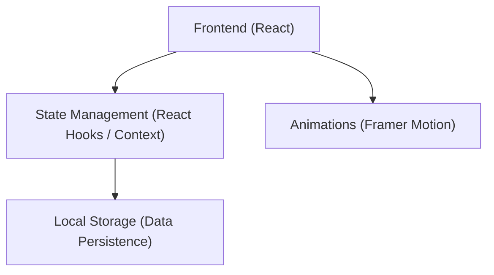
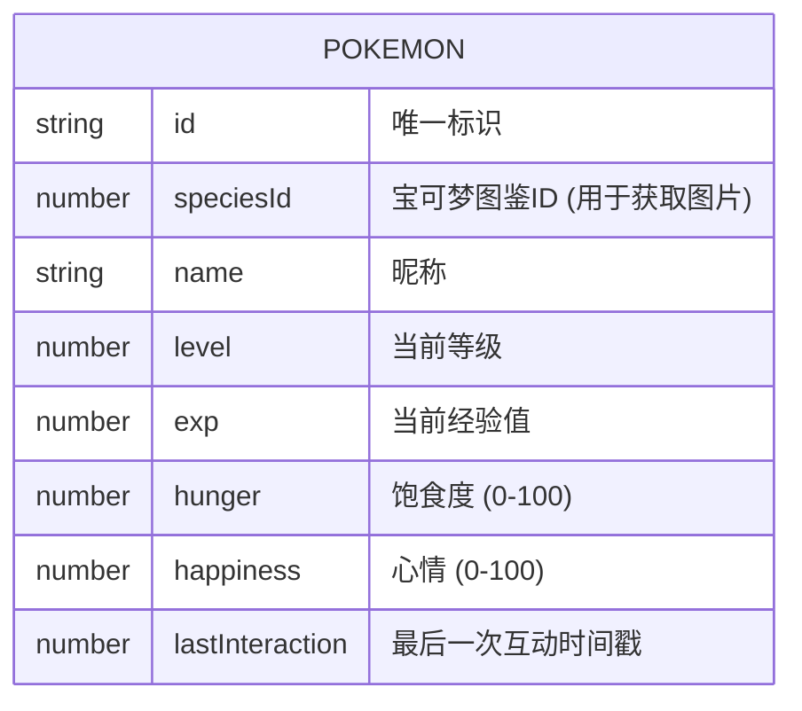

## 1. 架构设计

## 2. 技术说明
- **前端框架**: React@18 + Vite
- **样式方案**: TailwindCSS@3
- **动画库**: Framer Motion (用于页面切换、进化光效、互动反馈)
- **图标库**: Lucide React
- **数据持久化**: 浏览器 LocalStorage
- **资源来源**: 宝可梦图片可使用 PokeAPI 提供的官方绘图资源

## 3. 路由定义
本游戏为轻量级 Web 游戏，采用单页面组件状态切换或简易前端路由：
| 路由 | 目的 |
|-------|---------|
| / | 主页（领养中心/存档加载） |
| /play | 养成互动核心页 |

## 4. API 定义
本游戏完全基于前端和 LocalStorage，无需专属后端 API。
获取宝可梦图片静态资源使用公开 URL:
- `GET https://raw.githubusercontent.com/PokeAPI/sprites/master/sprites/pokemon/other/official-artwork/{id}.png`

## 5. 数据模型
### 5.1 数据模型定义
